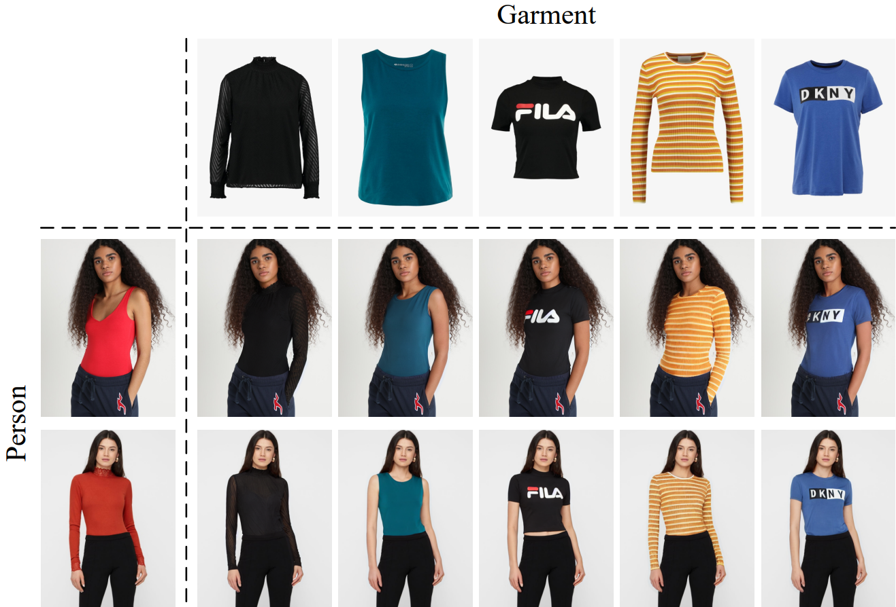

<h1>[ECCV 2024] D4-VTON</h1>

This repository is the official implementation of paper "Dynamic Semantics Disentangling for Differential Diffusion based Virtual Try-On".

    

<h1><strong>The code is coming soon~</strong></h1>
