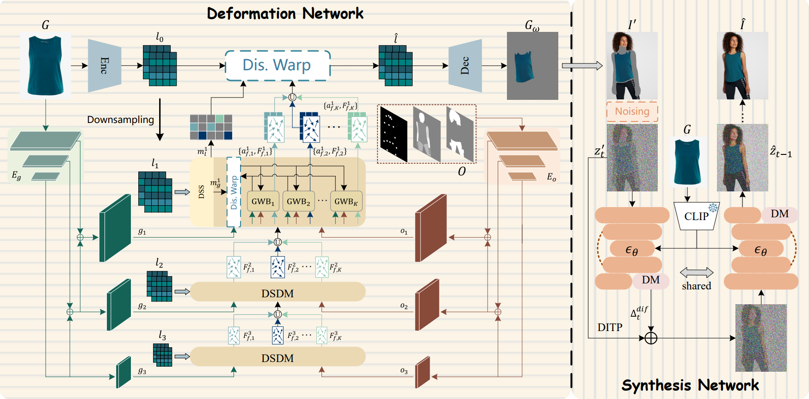
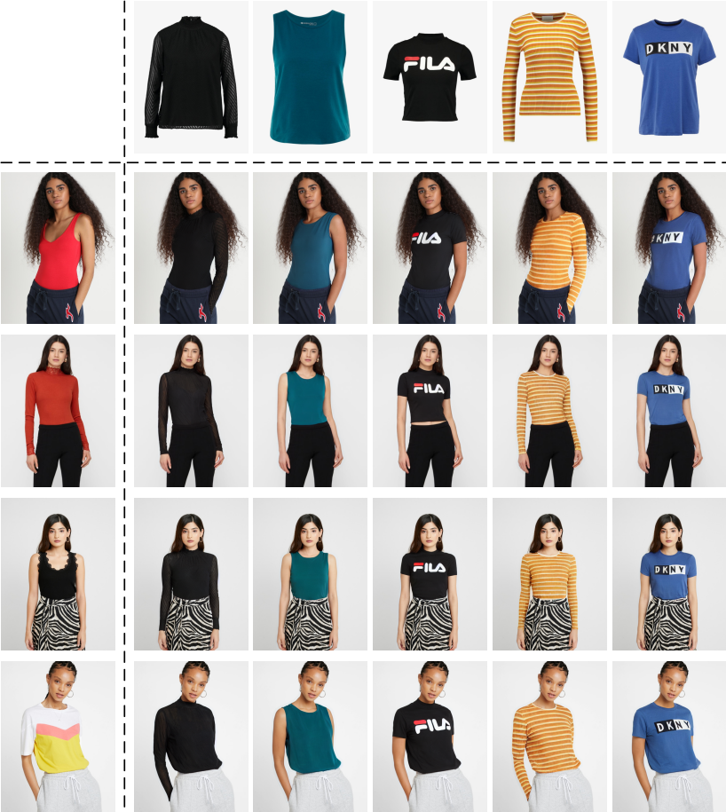

<h1>[ECCV 2024] D4-VTON</h1>
<a href='https://arxiv.org/abs/2407.15111'></a>
[](https://www.youtube.com/watch?v=_EEHaYDKd1M)

This is the official PyTorch codes for the paper:  
>**D$^4$-VTON: Dynamic Semantics Disentangling for Differential Diffusion based Virtual Try-On**<br>  [Zhaotong Yang](https://github.com/Jerome-Young), [Zicheng Jiang](https://github.com/bronyajiang), [Xinzhe Li](https://github.com/lixinzhe-ouc), [Huiyu Zhou](https://le.ac.uk/people/huiyu-zhou), [Junyu Dong](https://it.ouc.edu.cn/djy_23898/main.htm), [Huaidong Zhang](https://github.com/Xiaodomgdomg/), [Yong Du<sup>*</sup>](https://www.csyongdu.cn/) （ * indicates corresponding author)<br>
>Proceedings of the European Conference on Computer Vision

### Pipeline

<div style="width: 100%; text-align: center; margin:auto;">
    
</div>

### News

- ⭐**Aug 02, 2024:** We release inference and training code!
- ⭐**Jul 01, 2024:** D4-VTON was accepted into ECCV 2024!

## Getting started

### Setup

1. Clone and enter into repo directory.
```shell
git clone https://github.com/Jerome-Young/D4-VTON.git
cd D4-VTON
```
2. Install requirements using following scripts.
```shell
conda env create -f environment.yaml
conda activate d4-vton
```
3. Please download the pre-trained [vgg](https://drive.google.com/file/d/1rvow8jStPt8t2prDcSRlnf8yzXhrYeGo/view?usp=sharing) checkpoint and put it in `Synthesis_Stage/model/vgg/`.

### Data Preparation
To test the D4-VTON, you can download the VITON-HD(512 x 384) datasets from [GP-VTON](https://github.com/xiezhy6/GP-VTON).
Or you can re-train the entire model on the high resolution (1024 x 768) dataset.

## Inference

### Stage 1

Download the pre-trained checkpoint from [Google Drive](https://drive.google.com/file/d/1oPB-E6S2jz63wkLpz5-NxPMcYDlBewK6/view?usp=sharing), and put it in `Deformation_Stage/checkpoints/`.

To test the Deformation Network, run the following command:
```shell
cd Deformation_Stage

python -u test.py -b 16 --gpu 0 --name d4vton_deform --mode test \
--exp_name <unpaired-cloth-warp|cloth-warp> \
--dataroot <your_dataset_path> \
--image_pairs_txt <test_pairs_unpaired_1018.txt|test_pairs_paired_1018.txt> \
--ckpt_dir checkpoints/vitonhd_deformation.pt

# or you can run the bash scripts
bash scripts/test.sh
```

Then you should put the result directory `unpaired-cloth-warp` (for unpaired setting) or `cloth-warp` (for paired setting) under the test directory of VITON-HD dataset (i.e., `VITON-HD-512/test`).

### Stage 2

Download the pre-trained checkpoint from [Google Drive](https://drive.google.com/file/d/1rPGaxMZ5wgyrdoMtMTLJlvSkM8hd_UvV/view?usp=sharing), and put it in `Synthesis_Stage/checkpoints/`.

To test the Synthesis Network, run the following command:
```shell
cd Synthesis_Stage

python test.py --gpu_id 0 --ddim_steps 100 \
--outdir results/d4vton_unpaired_syn --config configs/vitonhd_512.yaml \
--dataroot <your_dataset_path> \
--ckpt checkpoints/vitonhd_synthesis.ckpt --delta_step 89 \
--n_samples 12 --seed 23 --scale 1 --H 512 --unpaired

# or you can run the bash scripts
bash scripts/test.sh
```

## Training

### Stage 1

Please download the pre-trained lightweight net from [Google Drive](https://drive.google.com/file/d/1SfkG0LCpfkgcPrKOg8-TPZwqRdrEVg5q/view?usp=sharing) for initialization and put it under the `Deformation_Stage/checkpoints` directory.

To train the Deformation Network, run the following command:
```shell
cd Deformation_Stage

python -m torch.distributed.launch --nproc_per_node=4 --master_port=6231 train.py \
--dataroot <your_dataset_path> \
-b 2 --num_gpus 4 --name d4vton_deform --group_num 8

# or you can run the bash scripts
bash scripts/train.sh
```

In a similar inference process, you should warp the clothes in the training set under the paired setting and rename the result directory to `cloth-warp`, then put them under the train directory of VITON-HD dataset (i.e., `VITON-HD-512/train`).

### Stage 2

We use the pretrained [Paint-by-Example](https://drive.google.com/file/d/15QzaTWsvZonJcXsNv-ilMRCYaQLhzR_i/view) checkpoint for initialization.  Please put it under the `Synthesis_Stage/checkpoints` directory.

To train the Synthesis Network, you first need to modify the `dataroot` in the `Synthesis_Stage/configs/vitonhd_512.yaml` file to your VITON-HD directory, and then run the following command:
```shell
cd Synthesis_Stage

python -u main.py --logdir models/d4vton_syn --pretrained_model checkpoints/model.ckpt \
--base configs/vitonhd_512.yaml --scale_lr False

# or you can run the bash scripts
bash scripts/train.sh
```

## Results

<div style="width: 100%; text-align: center; margin:auto;">
    
</div>

## Acknowledgements
Our code references the implementation of [DAFlow](https://github.com/OFA-Sys/DAFlow) and [DCI-VTON](https://github.com/bcmi/DCI-VTON-Virtual-Try-On). Thanks for their awesome works.

## Citation

If you find our work useful for your research, please cite us:
```
@article{yang2024d,
  title={D $\^{} 4$-VTON: Dynamic Semantics Disentangling for Differential Diffusion based Virtual Try-On},
  author={Yang, Zhaotong and Jiang, Zicheng and Li, Xinzhe and Zhou, Huiyu and Dong, Junyu and Zhang, Huaidong and Du, Yong},
  journal={arXiv preprint arXiv:2407.15111},
  year={2024}
}
```

## License

All material is made available under [Creative Commons BY-NC 4.0](https://creativecommons.org/licenses/by-nc/4.0/). You can **use, redistribute, and adapt** the material for **non-commercial purposes**, as long as you give appropriate credit by **citing our paper** and **indicate any changes** that you've made.
